# PRD: environment-hardening-and-configuration-decoupling (v2.0 Master)

## 1. Context & Problem (业务背景与核心痛点)

As the LEIO SDLC framework evolves toward multi-engine orchestration, the reliability of local development workstations (Cloudtop) and CI/CD environment runtimes becomes paramount. Currently, the framework suffers from a series of environment pollution and coupling issues that block headless executions, cause deadlocks, and damage developer productivity:

1. **Verifier Spawner workdir Mismatch**: Stateless direct CLI engines (e.g., `gemini_direct_cli`, `agy_direct_cli`) require a working directory (`workdir`) to resolve workspace arguments dynamically (e.g., `--add-dir {workdir}`). Currently, `spawn_verifier.py` fails to pass the parsed `workdir` context to `invoke_agent()`, causing fatal startup failures for direct CLI engines.
2. **LOAS SSO deadlocks in E2E Deploy Tests**: E2E deployment tests run in sandboxed, network-isolated directories. When a host has the `gemini` CLI installed, the deploy script attempts to run `gemini skills link` during E2E tests. Since E2E tests are non-interactive, this triggers LOAS SSO authentication prompts that stall indefinitely, deadlocking the CI pipeline.
3. **Brittle Dependency Bootstrapping**: Secure enterprise pip package registries or secure corporate mirrors occasionally lack common open-source packages like `PyYAML` or fail due to network limitations. This makes dependency installation during staging runtime provisioning fragile and blocks successful deployment.
4. **Overlay Erasure on Git Resets**: To support custom setups without committing them, the framework uses a two-tier system: `engines.default.json` (base defaults) and `engines.local.json` (user-specific local overlay, git-ignored). During orchestrator failure recovery or merging, `git clean -fd` is invoked, which completely wipes the uncommitted `engines.local.json` file from the developer's workstation.
5. **Workstation Port & Process Pollution**: Leftover zombie model API proxies and background server engines (like `gemini_api_prox` or `node_for_gemini`) from aborted runs consume workstation memory and lock network ports, causing subsequent pipeline runs to fail due to port collisions or state poisoning.

---

## 2. Requirements & User Stories (需求定义)

### FR-1: Verifier Spawner workdir Propagation
- **Description**: Update `scripts/spawn_verifier.py` to forward the parsed `workdir` argument directly to `invoke_agent()`. This ensures that stateless direct CLI engines can successfully resolve their workspace parameters and run without throwing missing-workdir fatal errors.
- **User Story**: As a developer running stateless direct CLI engines, I want the UAT verifier spawner to correctly propagate the working directory context so that my local/CI tests do not abort due to missing workspace configurations.

### FR-2: Hermetic E2E Deploy Tests via Gemini CLI Mock Stub
- **Description**: Introduce a dedicated mock stub script `tests/trap_stub_gemini.sh` that intercepts `skills link` commands and exits `0` immediately. Update `tests/deploy_test_support.py` to inject this stub as `gemini` into the sandboxed environment's `PATH` during `isolated_repo_env` execution. This permanently isolates E2E tests from host-installed CLI binaries and eliminates SSO/LOAS deadlocks.
- **User Story**: As a release engineer, I want sandboxed E2E deployment tests to bypass the host's `gemini` CLI and its authentication prompts so that our CI pipeline runs 100% offline and never deadlocks.

### FR-3: Self-healing Pip Registry Fallbacks
- **Description**: Update `deploy.sh` (via `scripts/provision_runtime.sh`), `skills/pm-skill/deploy.sh`, and `scripts/dev_python.sh` to catch `pip install` failures and automatically retry the installation with `--extra-index-url https://pypi.org/simple` to bypass primary secure mirror outages or package gaps (e.g., missing `PyYAML`).
- **User Story**: As a developer, I want python environment bootstrapping to automatically fall back to standard public indices if the secure mirror lacks critical packages so that my workstation setup is self-healing and resilient.

### FR-4: Template-driven Configuration Overlay & Reset Safeguard
- **Description**: Establish `config/engines.default.json` as the base template. Update `deploy.sh` to copy `config/engines.default.json` to `config/engines.local.json` as an overlay initial setup if the local config does not exist. Update `scripts/orchestrator.py` to use `git clean -fd -e config/engines.local.json` instead of `git clean -fd` during failure recovery or merge resets to permanently safeguard developer-specific configuration overlays.
- **User Story**: As an architect, I want my custom local engine configurations to be preserved across orchestrator failure resets and successful branch merges so that I do not have to recreate my local settings after every run.

### FR-5: Configurable Preflight Cleanup Hooks
- **Description**: Define a `"preflight_cleanup_processes"` array configuration in `config/engines.default.json` containing `["gemini_api_prox", "node_for_gemini"]`. In `scripts/orchestrator.py` preflight startup, read this configuration and dynamically find and safely terminate/reap active matching PIDs on the workstation (excluding the orchestrator's own PID and parent PID) before starting execution phases.
- **User Story**: As a system operator, I want active stale proxy or engine server processes to be sterilized before starting a new SDLC run so that port locking or process leaks do not degrade subsequent execution runs.

---

## 3. Architecture & Technical Strategy (架构设计与技术路线)

```mermaid
graph TD
    A[Orchestrator Preflight Startup] --> B[Process Sterilization Hook]
    B -->|Read config/engines.default.json| C[Kill preflight_cleanup_processes PIDs]
    C --> D[Initialize Sandbox Run]
    D --> E[Run spawn_verifier.py]
    E -->|Propagates workdir context| F[invoke_agent with workdir=workdir]
    
    G[deploy.sh Execution] --> H[Create engines.local.json overlay template]
    G --> I[Provision python runtime]
    I -->|Failed secure pip install| J[Retry with --extra-index-url pypi.org]
    
    K[Orchestrator Reset & Merge] --> L[Safe Git Clean]
    L -->|git clean -fd -e config/engines.local.json| M[Overlay preserved]
```



### 3.1 Decoupled Engine Context Routing
Stateless direct CLI engines rely entirely on the orchestrator injecting environment variables and workdir paths. When `spawn_verifier.py` executes, it must treat the environment as a decoupled, stateless target, routing UAT commands through the `invoke_agent()` router with full path context.

### 3.2 Sandboxed E2E Environment Isolation
By prepending a staged directory containing `gemini` mock stubs into the sandboxed `PATH` inside `isolated_repo_env`, we fully decouple the execution of E2E deployment tests from the host's machine state. This represents a robust architectural firewall that stops host-level LOAS SSO requests from polluting or stalling sandboxed executions.

---

## 4. Acceptance Criteria (BDD 黑盒验收标准)

### Scenario 1 (FR-1): Verifier workdir Context Propagation
- **Given** a stateless direct CLI engine is configured as the active driver (e.g., `LLM_DRIVER=gemini_direct_cli`)
- **And** a working directory lock is parsed as the `--workdir` command-line argument in `spawn_verifier.py`
- **When** `spawn_verifier.py` executes the agent invocation phase
- **Then** `spawn_verifier.py` propagates the `workdir` keyword argument value to `invoke_agent(workdir=workdir)`
- **And** the execution resolves the workspace arguments successfully without throwing missing-workdir fatal errors.

### Scenario 2 (FR-2): offline Sandboxed E2E Deploy Test Execution
- **Given** an E2E deployment test runs inside the sandboxed `isolated_repo_env` context
- **And** the mock stub at `tests/trap_stub_gemini.sh` is injected into the sandboxed `PATH` as `gemini`
- **When** `deploy.sh` or `skills/pm-skill/deploy.sh` executes the `gemini skills link` command
- **Then** the command resolves to the mock stub script instead of the host system's `gemini` binary
- **And** it intercepts the `skills link` arguments, prints `[MOCK] Intercepted gemini skills link`, and exits with status `0`
- **And** the deployment E2E test finishes successfully with no network interactions or interactive SSO hangs.

### Scenario 3 (FR-3): Self-healing Pip Installation Recovery
- **Given** a staging runtime python environment is being provisioned via `scripts/provision_runtime.sh` or `scripts/dev_python.sh`
- **And** the primary secure package registry lacks `PyYAML` or is temporarily down
- **When** the primary `pip install` command fails (returns a non-zero exit status)
- **Then** the bootstrap runner captures the failure and automatically retries the command:
  `pip install --extra-index-url https://pypi.org/simple ...`
- **And** the environment setup successfully completes, allowing runtime execution to proceed cleanly.

### Scenario 4 (FR-4): Preservation of Configuration Overlays on Git Clean
- **Given** a developer has created a customized local overlay at `config/engines.local.json`
- **When** the Orchestrator triggers a failure recovery reset or a post-merge teardown sequence
- **Then** the Orchestrator runs the git clean command strictly using:
  `git clean -fd -e config/engines.local.json`
- **And** the local config file `config/engines.local.json` is untouched and remains intact on the disk.

### Scenario 5 (FR-5): Preflight Process Sterilization
- **Given** zombie `gemini_api_prox` or `node_for_gemini` processes are active from an aborted previous run
- **When** `orchestrator.py` starts a new execution run and executes the preflight check phase
- **Then** the Orchestrator resolves `"preflight_cleanup_processes"` from the loaded engines registry config
- **And** it identifies the active PIDs of matching processes on the workstation (excluding current/parent process PIDs)
- **And** it forcefully reaps and terminates those PIDs before booting up any sub-agents or verifier runs.

---

## 5. Overall Test Strategy & Quality Goal (测试策略与质量目标)

- **Quality Risks**: 
  1. Flaky E2E tests on CI due to environment-specific credentials or network access limits.
  2. Destructive data loss of uncommitted files in local workspaces.
- **Mocking Strategy**: Avoid real external network dependencies during unit and integration test runs. Use `tests/trap_stub_gemini.sh` exclusively inside the sandboxed `isolated_repo_env` environment to test dual-compatibility integration.
- **Architectural SLA Speed Goals**:
  - **Cloudtop Workstation Run**: Preflight checks, sterilization, and startup sequence must resolve in **~2 minutes**.
  - **CI/CD Pipeline Execution**: Full setup, environment bootstrap, and preflight phases must complete under **~5 minutes**.
  > [!IMPORTANT]
  > **Non-functional Quality SLA**: The preflight speed goals (~2 mins Cloudtop, ~5 mins CI) are strictly non-functional quality SLAs and architectural targets. They **MUST NEVER** be hardcoded as assertions inside automated unit tests or integration tests to avoid flaky test suites and fragile build environments.

---

## 6. Framework Modifications (框架防篡改声明)

The Coder is authorized to make targeted modifications to the following framework files:
- `scripts/spawn_verifier.py`
- `tests/deploy_test_support.py`
- `deploy.sh`
- `skills/pm-skill/deploy.sh`
- `scripts/dev_python.sh`
- `scripts/provision_runtime.sh`
- `config/engines.default.json`
- `scripts/orchestrator.py`

---

## 7. Hardcoded Content (硬编码内容)

> [!IMPORTANT]
> **Anti-Hallucination Policy (防幻觉策略):** The Coder must copy-paste the following raw strings, command lines, parameters, and config patterns exactly as written. Do not modify, alter, or expand upon the following values.

### 7.1 `tests/trap_stub_gemini.sh` Bash Mock Code
```bash
#!/bin/bash
# Mock stub for gemini CLI to prevent SSO deadlocks in testing
if [ "$1" = "skills" ] && [ "$2" = "link" ]; then
  echo "[MOCK] Intercepted gemini skills link"
  exit 0
fi
echo "[MOCK] Unrecognized gemini stub command: $@"
exit 1
```

### 7.2 `config/engines.default.json` Target Updates

```json
{
  "preflight_cleanup_processes": [
    "gemini_api_prox",
    "node_for_gemini"
  ],
  "engines": {
    "gemini_direct_cli": {
      "engine_id": "gemini_direct_cli",
      "cli_alias": "gemini",
      "display_name": "Gemini Direct CLI",
      "runtime_mode": "direct_cli",
      "registration_visibility": "public",
      "continuity_mode": "stateless",
      "handle_acquisition_strategy": "unavailable",
      "fallback_policy": "fail_closed",
      "capability_surface": "client_mediated",
      "execution": {
        "executable": "gemini",
        "one_shot_args": ["--print-timeout 3600s"],
        "model_arg": {"flag": "--model", "value": "{model}"},
        "workspace_arg": null,
        "permission_args": [],
        "sandbox_args": [],
        "timeout_seconds": 3600,
        "env_extra": {}
      }
    }
  }
}
```

### 7.3 `git clean` Exclude Override Command
```text
git clean -fd -e config/engines.local.json
```

### 7.4 `spawn_verifier.py` Parameter Invocation Update Signature
```text
workdir=workdir
```
