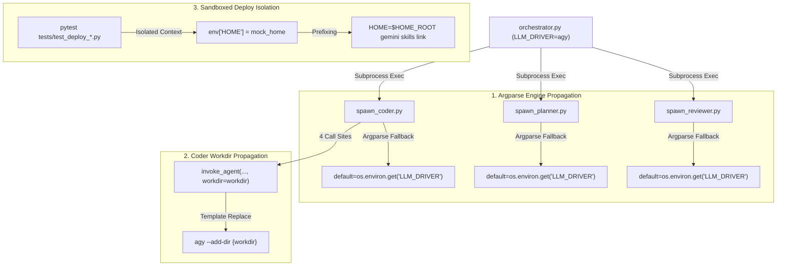

# PRD: fix-deploy-host-pollution (v7.0 Master)

## 1. Context & Problem (业务背景与核心痛点)

我们在 `leio-sdlc` 的集成测试、部署、多引擎派生以及编排管道中发现了 6 个关键缺陷（Bugs），它们分别破坏了测试环境的密闭性（Hermeticity）、多引擎环境下的参数传递（Engine Propagation）、工作目录的完整向下流转、直接 CLI 引擎（Antigravity/agy）的可用性，以及核心编排方法中的签名兼容性：

### Bug 1: E2E 测试污染宿主环境 (`~/.gemini/skills` 链接篡改)
当开发者在本地运行 Python E2E/集成测试时，测试框架会拉起一个临时沙箱目录（`/tmp/deploy-isolation-XXXXXX`）并设置 `HOME_MOCK` 来隔离部署目录。然而，由于测试环境没有完全隔离标准的 `HOME` 环境变量，导致部署脚本中调用的**真实 `gemini` 命令行工具**依然使用真实的 `$HOME`。这导致真实的 `~/.gemini/skills/` 目录下的软链接被篡改，指向了临时的测试沙箱目录。测试结束后临时目录被删除，导致开发者的真实开发环境遗留了失效的断链接（broken symlinks）。

### Bug 2: Spawner 引擎参数传递失效 (子 Agent 强制覆盖为 `openclaw`)
当用户通过 `--engine agy`（或 `gemini`）显式指定非默认引擎启动 `orchestrator.py` 时，编排器会将引擎注入到环境变量 `LLM_DRIVER` 中并启动子进程。但是，由于 `orchestrator.py` 没有在命令行参数中显式向下透传 `--engine`，而子 Agent（`spawn_planner.py` 和 `spawn_coder.py`）的 `argparse` 将 `--engine` 的默认值硬编码为注册表中的静态默认值（`"openclaw"`），且没有回退到 `LLM_DRIVER` 环境变量。这导致子 Agent 在解析命令行时拿到默认值 `"openclaw"`，并看到其与环境中的 `"agy"` 不一致，从而**强行覆盖重写** `os.environ["LLM_DRIVER"] = "openclaw"`，最终导致子 Agent 调用已不存在的 `openclaw` 二进制而发生崩溃（FileNotFoundError）。

### Bug 3: Coder 工作目录流转丢失 (`workdir` 传播遗漏)
在 `spawn_coder.py` 中，存在 4 处调用 `invoke_agent` 的地方（涉及反馈提交、初始执行、修改迭代以及系统警报路由）。由于这些调用 site 均遗漏了向 `invoke_agent` 显式透传当前的 `workdir` 属性，导致当底层使用 direct_cli 引擎（如 `agy`，其在 `engines.default.json` 中定义了 `workspace_arg` 模板参数 `--add-dir {workdir}`）时，无法正确传递当前的工作目录。

### Bug 4: Antigravity (agy) 执行超时与连接等待限制
底层 direct_cli 引擎 `agy` 存在硬编码的 300 秒（5分钟）执行超时限制以及 5 分钟的连接等待时间。在遇到复杂的生成或长链路推理任务时，任务会因超时而提前被截断。因此，必须将 `timeout_seconds` 提升至 3600 秒，并在 single shot 命令行参数中追加 `--print-timeout 3600s` 以保证连接持续性。

### Bug 5: Reviewer Spawner 引擎参数传递失效
与 Bug 2 类似，`spawn_reviewer.py` 独立子 Agent 的 `argparse` 入口将 `--engine` 默认值硬编码为 `"openclaw"`。如果在环境变量中设置了 `LLM_DRIVER`（如 `agy` 或 `gemini`），由于 argparse 的硬编码默认值会直接覆盖当前进程 of `LLM_DRIVER` 环境变量，导致评审层（Reviewer）在启动时同样会出现与编排层指定的引擎不一致，进而调用错误的默认引擎引发崩溃。

### Bug 6: Orchestrator Null-Output 签名不匹配 (Signature Mismatch)
在 `scripts/orchestrator.py` 里的重试与故障检测逻辑中，核心方法 `classify_coder_null_output` 在进行空输出（null-output）分类与恢复检查时，部分场景需要支持 `default_branch` 参数的流入。然而，该方法的定义签名中并未包含 `default_branch` 变量，导致调用该方法时发生 `TypeError` 参数签名不匹配错误。

---

## 2. Requirements & User Stories (需求定义)

- **FR-1**: 部署脚本（`deploy.sh` 和 `skills/pm-skill/deploy.sh`）在调用 `gemini skills link` 时，必须显式绑定当前部署的 `HOME_ROOT`，确保在 `HOME_MOCK` 激活时，链接注册在 mock home 中。
- **FR-2**: 测试隔离助手（`tests/deploy_test_support.py` 中的 `isolated_repo_env`）必须将标准的 `HOME` 环境变量显式重写为 `mock_home`，防止任何子进程/宿主工具（如未 mock 的 `gemini`）逃逸沙箱。
- **FR-3**: 子 Agent（`spawn_planner.py`、`spawn_coder.py` 以及 `spawn_reviewer.py`）必须在其 `argparse` 参数解析中，将 `--engine` 的默认值设定为 `os.environ.get("LLM_DRIVER", default_engine)`。这使得它们能够优雅地从父环境继承编排引擎，避免粗暴覆盖。
- **FR-4**: Coder 派生层在所有 4 处 `invoke_agent` 调用中，必须显式传递当前已锁定的 `workdir` 变量（`workdir=workdir` 或 `workdir=args.run_dir`），确保 workspace 参数完整向下传播。
- **FR-5**: Antigravity (agy) 引擎的超时上限及最大连接保持时长调整为 3600 秒。
- **FR-6**: 修正 `classify_coder_null_output` 签名，引入可选的 `default_branch=None` 默认参数以保证向前与向后兼容。

*注意：本 PRD 所有需求与修改范围均排除 `scripts/e2e/setup_sandbox.sh`（该文件已由用户在 commit 5935359 中独立修复，无需在此处理）。*

---

## 3. Architecture & Technical Strategy (架构设计与技术路线)



---

## 4. Acceptance Criteria (BDD 黑盒验收标准)

### Scenario 1: Real User Deployment (生产部署行为不受影响)
- **Given** 用户在真实宿主环境下运行 `./deploy.sh` 或 `bash skills/pm-skill/deploy.sh`
- **When** `gemini` 命令行工具可用
- **Then** 技能被正确软链接到真实的 `~/.gemini/skills/`
- **And** 软链接指向真实的 `~/.openclaw/skills/` 目录

### Scenario 2: Python Test Execution Isolation (测试彻底隔离不污染宿主)
- **Given** 运行 `pytest tests/` 集成测试
- **When** 测试调用 `deploy.sh` 并触发 `gemini skills link`
- **Then** 真实的宿主目录 `~/.gemini/skills/` **不发生任何改变**
- **And** 软链接只会被创建在临时沙箱内（例如 `/tmp/deploy-isolation-XXXXXX/home/.gemini/skills/`）

### Scenario 3: Engine Propagation (引擎参数完美向下传递)
- **Given** 运行 `orchestrator.py --engine agy` 启动编排器
- **When** 编排器派生 `spawn_planner.py`、`spawn_coder.py` 或 `spawn_reviewer.py` 子进程且未在 CLI 显式指定 `--engine`
- **Then** 子进程将默认引擎解析为 `agy`（通过继承 `LLM_DRIVER`）
- **And** 子进程不重写 `os.environ["LLM_DRIVER"]` 为 `openclaw`
- **And** 子进程成功使用 `agy` 驱动执行，不触发默认 `openclaw` 崩溃异常

### Scenario 4: Coder Workdir Propagation (编码阶段 Workdir 彻底透传)
- **Given** Coder spawner 已锁定本地代码库的工作区 `workdir`
- **When** Coder 进行初始化、反馈迭代、重试或发送系统警报，调用任意 `invoke_agent` site
- **Then** `invoke_agent` 必须带有 `workdir=workdir` 参数
- **And** 调用的 direct_cli `agy` 命令中，`--add-dir` 参数接收到的实际值与 `workdir` 完全一致

### Scenario 5: agy Timeout Expansion (Antigravity 引擎超时放开)
- **Given** 配置引擎注册表 `config/engines.default.json`
- **When** 使用 `agy` 引擎启动编码或生成任务
- **Then** 进程超时上限 `timeout_seconds` 为 `3600`
- **And** 启动命令的 one_shot_args 列表中包含 `"--print-timeout"` 与 `"3600s"`

### Scenario 6: Null-Output Signature Compatibility (分类空输出参数兼容)
- **Given** Coder 完成执行，`orchestrator.py` 开始进行空输出分类
- **When** 调用 `classify_coder_null_output` 并有可能透传 `default_branch` 参数
- **Then** 方法定义完全接收并正确处理 `default_branch` 参数（其默认值为 `None`）
- **And** 不会引发任何 `TypeError: classify_coder_null_output() takes ... positional arguments but ... were given` 异常

---

## 5. Overall Test Strategy & Quality Goal (测试策略与质量目标)

- **验证手段**:
  1. 运行全部部署相关的 pytest 测试：`pytest tests/test_deploy_*.py`
  2. 运行 bash 集成测试：`bash scripts/test_deploy_hardcopy.sh`
  3. **引擎连通性测试**：使用 `--engine agy` 和 `--engine gemini` 启动本地沙箱运行，确保 Planner、Coder 与 Reviewer 均能顺畅工作不崩溃。
  4. **宿主环境对比验证**：在运行测试前后，通过 `ls -la ~/.gemini/skills` 确认没有新增或篡改任何链接。
  5. **Orchestrator Resilience 单元测试验证**：运行 `pytest tests/test_orchestrator_resilience.py` 以验证空输出分类签名的正确性。

---

## 6. Framework Modifications (框架防篡改声明)

以下核心框架文件已被授权修改以实现本 PRD 的安全与架构升级策略：
- `deploy.sh` — 绑定 `gemini` 执行期的 `HOME`。
- `skills/pm-skill/deploy.sh` — 同步绑定 `gemini` 执行期的 `HOME`。
- `tests/deploy_test_support.py` — 注入 `env["HOME"]` 到隔离环境中。
- `scripts/spawn_planner.py` — 修改 `--engine` 默认值读取 `LLM_DRIVER` 环境变量。
- `scripts/spawn_coder.py` — 修改 `--engine` 默认值读取 `LLM_DRIVER` 环境变量，并在所有 4 个 `invoke_agent` 调用 site 中透传 `workdir` 参数。
- `scripts/spawn_reviewer.py` — 修改 `--engine` 默认值读取 `LLM_DRIVER` 环境变量。
- `config/engines.default.json` — 放开 `agy` 的超时时长上限为 3600 秒，并扩增 `--print-timeout` 参数。
- `scripts/orchestrator.py` — 修改 `classify_coder_null_output` 定义，添加 `default_branch=None` 以匹配接口签名。

---

## 7. Hardcoded Content (硬编码内容)

### Exact Text Replacements:

#### For `deploy.sh` (around line 166):
```diff
-        gemini skills link "$PROD_DIR"  --consent || echo "⚠️ Gemini link failed, but deployment succeeded."
+        HOME="$HOME_ROOT" gemini skills link "$PROD_DIR"  --consent || echo "⚠️ Gemini link failed, but deployment succeeded."
```

#### For `skills/pm-skill/deploy.sh` (around line 76):
```diff
-    gemini skills link "$PROD_DIR" --consent || echo "⚠️ Gemini link failed, but deployment succeeded."
+    HOME="$HOME_ROOT" gemini skills link "$PROD_DIR" --consent || echo "⚠️ Gemini link failed, but deployment succeeded."
```

#### For `tests/deploy_test_support.py` (around line 129):
```diff
         env = os.environ.copy()
         env["HOME_MOCK"] = str(mock_home)
+        env["HOME"] = str(mock_home)
```

#### For `scripts/spawn_planner.py` (around line 29):
```diff
-    parser.add_argument("--engine", choices=dynamic_choices, default=default_engine, help=f"Execution engine to use for the agent driver (default: {default_engine})")
+    parser.add_argument("--engine", choices=dynamic_choices, default=os.environ.get("LLM_DRIVER", default_engine), help=f"Execution engine to use for the agent driver (default: {default_engine})")
```

#### For `scripts/spawn_coder.py` (around lines 434, 530, 646, 679, 809):
```diff
@@ -433,3 +433,3 @@
 def send_feedback(session_key, message, workdir=".", run_dir=".", thinking: str | None = None):
-    result = invoke_agent(message, session_key=session_key, role="coder", run_dir=run_dir, thinking=thinking)
+    result = invoke_agent(message, session_key=session_key, role="coder", run_dir=run_dir, workdir=workdir, thinking=thinking)
     print(f"Sent feedback to session {result.session_key}")
@@ -529,3 +529,3 @@
     else:
-        result = invoke_agent(rendered_prompt, session_key=session_key, role="coder", run_dir=run_dir, thinking=thinking)
+        result = invoke_agent(rendered_prompt, session_key=session_key, role="coder", run_dir=run_dir, workdir=workdir, thinking=thinking)
         # Only write .coder_session for stateful engines
@@ -645,3 +645,3 @@
     else:
-        result = invoke_agent(rendered_prompt, session_key=session_key, role="coder", run_dir=run_dir, thinking=thinking)
+        result = invoke_agent(rendered_prompt, session_key=session_key, role="coder", run_dir=run_dir, workdir=workdir, thinking=thinking)
         # Only write .coder_session for stateful engines
@@ -676,6 +676,6 @@
     parser.add_argument(
         "--engine",
         choices=dynamic_choices,
-        default=default_engine,
+        default=os.environ.get("LLM_DRIVER", default_engine),
         help=f"Execution engine to use for the agent driver (default: {default_engine})",
     )
@@ -808,3 +808,3 @@
 
-    result = invoke_agent(rendered_prompt, session_key=session_key, role="coder", run_dir=args.run_dir, thinking=resolved_thinking)
+    result = invoke_agent(rendered_prompt, session_key=session_key, role="coder", run_dir=args.run_dir, workdir=workdir, thinking=resolved_thinking)
     # Only write .coder_session for stateful engines
```

#### For `scripts/spawn_reviewer.py` (around line 85):
```diff
-    parser.add_argument("--engine", choices=dynamic_choices, default=default_engine, help=f"Execution engine to use for the agent driver (default: {default_engine})")
+    parser.add_argument("--engine", choices=dynamic_choices, default=os.environ.get("LLM_DRIVER", default_engine), help=f"Execution engine to use for the agent driver (default: {default_engine})")
```

#### For `config/engines.default.json` (around lines 45-56):
```diff
@@ -45,12 +45,12 @@
       "execution": {
         "executable": "agy",
-        "one_shot_args": ["--print"],
+        "one_shot_args": ["--print", "--print-timeout", "3600s"],
         "model_arg": null,
         "workspace_arg": {"flag": "--add-dir", "value": "{workdir}"},
         "permission_args": ["--dangerously-skip-permissions"],
         "sandbox_args": ["--sandbox"],
-        "timeout_seconds": 300,
+        "timeout_seconds": 3600,
         "env_extra": {},
         "default_model": null
       }
```

#### For `scripts/orchestrator.py` (around line 301):
```diff
-def classify_coder_null_output(workdir, attempt_head, coder_returncode):
+def classify_coder_null_output(workdir, attempt_head, coder_returncode, default_branch=None):
```
